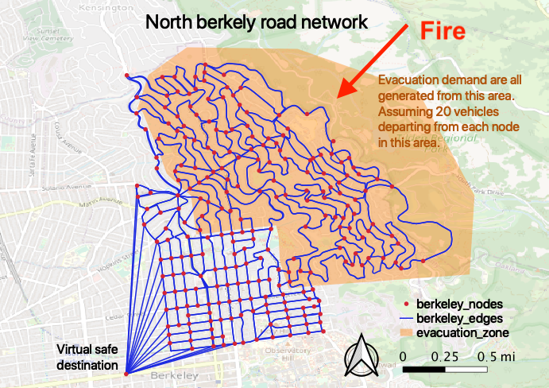
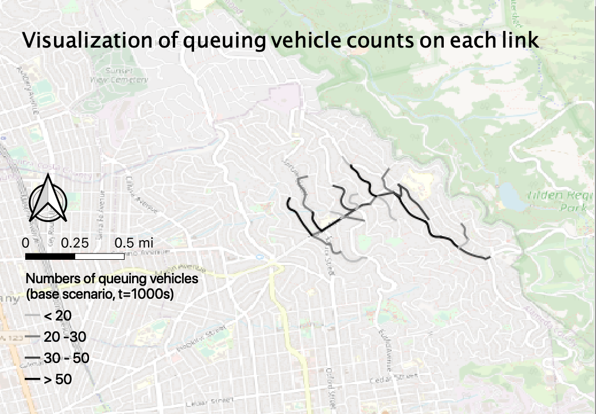

# Assignment 2

## Overview

In this assignment, you are given a hypothesized Berkeley Hills fire scenario. Your task is to find the suitable locations for contraflow so that more people can get out of the danger in less time. You can evaluate the base scenario (no contraflow) and your contraflow strategies by running a spatial queue-based dynamic traffic assignment code provided to you. All together, we have prepared the following codes/inputs for you: 
* a code starter of the spatial queue model: follow the link at the bottome of the page to access the code on colab.
* a base network inputs file: [berkeley_edges.csv](https://raw.githubusercontent.com/UCB-CE170a/Fall2020/master/traffic_data/berkeley_edges.csv) and [berkeley_nodes.csv](https://raw.githubusercontent.com/UCB-CE170a/Fall2020/master/traffic_data/berkeley_nodes.csv). These are the original road network without contraflow.
* od inputs file: [od_20pn.csv](https://raw.githubusercontent.com/UCB-CE170a/Fall2020/master/traffic_data/od_20pn.csv). This travel demand input file assumes that there are 20 vehicles originating from each node in the evacuation area.

## Study area

The figure below shows our study area and the road network in North Berkeley. The red dots and blue lines are the road network nodes and links. In Berkeley, the west side (Berkeley Hills) has higher elevation and are covered by denser vegetation, while the east side (Downtown) is flatter and more urbanized. A wildfire is assumed to come from the northeast direction and all residents living in the orange area are ordered to evacuate. The road network node at the bottom left corner denotes a virtual safe destination, where all evacuees go.

In order to simplify the task, we made the following assumptions:
- We do not explicitly model fire propagation. The fire direction is given in the figure above only for illustration purpose;
- The evacuation demand is simply set as 20 vehicles per node in the evacuation zone. A more realistic approach would be to obtain the land use and demographic data for the study area and then associate the demand to the origin nodes.
- It is assumed that all evacuees leave at once.
- Background traffic (i.e., those that are not evacuation trips) are ignored. In reality, background traffic could potentially add more congestion and delays to the evacuation process.
- The rerouting frequency is set at 3600s, which basically indicates that evacuees do not reroute. You may want to vary this rerouting frequency parameter in the code for your report (but do not change it for the results submitted on September 30th). Based on our experience, enable frequent rerouting is a much more effective strategy than contraflow in evacuation. However, let's not consider this factor when you are testing contraflow locations.

Take a moment to download and examine the [berkeley_edges.csv](https://raw.githubusercontent.com/UCB-CE170a/Fall2020/master/traffic_data/berkeley_edges.csv) road links file in QGIS. Notice that each road link has several attributes, such as `lanes`, `capacity`, `fft`, etc. For example, the two road links with `link_id` = 39 and 132 are two directions of same road (Marin Avenue) between Santa Barbara Road and Spruce Street, each having two lanes. If you are to implement contraflow here, you can either increase the number of lanes of link 39 (the downhill direction) to 3 and reduce the number of lanes of its opposite direction to 1, or increase the number of lanes of 39 (the downhill direction) to 4 and reduce the number of lanes of its opposite direction to 0. The bottom line is, the total number of lanes in both directions should remain the same with or without contraflow.

Link capacity (1900 vehicles/(lane * hour)) will ve automatically re-calculated each time you run the simulation. Link free flow travel time, `fft`, is also calculated automatically by the code. If you specify the number of lanes to be 0 for a link,  `fft` will be set to a very large number `1e8` so as to prevent the shortest path function from using it.

|link_id  | start_node_id| end_node_id  |  type   | length  |maxmph   |lanes    | capacity| fft      | ... |
|---------|--------------|--------------|---------|---------|---------|---------|---------|----------|-----|
|39       |151           |226           |tertiary |117.67   |25.0     |2        |3800     |10.53.    |-----|
|132      |226           |151           |tertiary |117.67   |25.0     |2        |3800     |10.53.    |-----|

## Instruction
#### 1. Run the base scenario
Follow the colab link at the bottom of the page. Set the `scenario` variable to `base` and run through each block. The code should give you three types of output files:
- `t_stats_base_[yourname].csv`: records how many evacuees have successfully arrived at the destination node at different time steps;
- `traffic_outputs/link_stats/link_stats_[yourname]_t[...].csv`: contains information on the numbers of running vehicles (column `r`) and queueing vehicles (colume `q`) for each link at different time steps. You can directly visualize this in QGIS;
- `traffic_outputs/node_stats/node_stats_[yourname]_t[...].csv`: contains information on the number of vehicles that are still in their origin node. These vehicles haven't started their journey because even the first link in their path is congested.

Examine the output files `traffic_outputs/link_stats/link_stats_[yourname]_t[...].csv` or `traffic_outputs/node_stats/node_stats_[yourname]_t[...].csv` in QGIS and decide where you want to implement contraflow. For example, the image below shows the numbers of queued vehicles on each road link at 1000 seconds for the base scenario. Now, do you think this is a good visualization to identify the bottleneck locations? Would queue density rather than queue counts give more insights? Or shall we also include the numbers of running vehicles?

#### 2. contraflow scenario
Prepare a csv file titled `contraflow_edges_[yourname].csv` which holds the information of the contraflow links. Specifically, the file contains two columns, one is the link id where contraflow is implemented and the other is the new number of lanes. For example, if you want to do contraflow on the southward direction on Oxford Street between Cedar Street and Hearst Avenue, your `contraflow_edges_[yourname].csv` should look like:
| link_id  | new_lanes |
|----------|-----------|
|  40      | 3         |
| 123      | 1         |
| 112      | 3         |
| 186      | 1         |

Note that the validity `contraflow_edges_[yourname].csv` is a main component that we are going to review when marking your homework. Please make sure:
- The numbers of intersections involved are less than or equal to 15. For example, if we want to implement contraflow on the southward direction on Oxford Street between Cedar Street and Hearst Avenue, there are three intersections involved (node_id: 53, 78, 121). This is because in reality, there needs to be personnel at the intersection to instruct contraflow and personnel may be very limited in an emergency evacuation.
- Since the total width of a road is fixed, when you want to implement contraflow (increasing the numbers of lanes) on one direction of the road, remember to reduce the numbers of lanes on the other direction accordingly.
- The links leading to the virtual destination (node_id = 237) are all one-way and already have very large capacity. They should not be the bottleneck of the evacuation simulation and you don't need to implement contraflow on them.
- Please do not include the information for road links where contraflow is not implemented.

Run the code again from top after change the `scenario` variable to `contraflow`.

## Submission
Your submissions consist of two parts:
1. September 30th, 10:00 am PDT: 
    * A CSV file, titled `contraflow_edges_[yourname].csv` that reflects the changes in the network according your contraflow strategy.
    * Time stepped arrival counts: `t_stats_base_[yourname].csv` and `t_stats_contraflow_[yourname].csv`. These are output from the simulation code.
    * Any additional text justifying your selection of contraflow locations.
2. October 8th, 2:00 pm PDT:
    * Report outlining your findings and any additional insights that you gained during our last lecture, when we will review the quantitative results of the whole class. The report should include at least a map, potentially more, showing the queueing status at certain time step and  scenario (with legned, scale, north arrow, title, and background map). You are encouraged, though not required, to change the code to test, e.g., the impact of rerouting or staged evacuation and include the findings in your report.

## Evaluation
You will be evaluated by the following criteria:
1. The `contraflow_edges_[your_name].csv`: the total numbers of intersections involved are no more than 15.
2. The `contraflow_edges_[your_name].csv`: when you increase the number of lanes on one side of the road, the  number of lanes on the opposite side should reduce accordingly.
4. The `contraflow_edges_[your_name].csv`: the code should be able to run with this new input file.
5. You will **NOT** be evaluated by a single measure effectiveness of your contraflow strategy. For example, even if under your strategy, the arrival curve is lower, or the time it takes for all evacuees to arrive at the safe destination (i.e., "network clearance time") is longer, you will not be penalized. Just state the reason for your choice of contraflow locations. For example, "people can get away from the source of the danger faster", or "people can leave the evacuation zone faster, though they may spend more time outside of their evacuation zone". Please be as creative as possible in designing your strategy, so that we will be able to review a diverse range of scenarios in our last class.
6. Quality of report.

Click the icon below to start:

