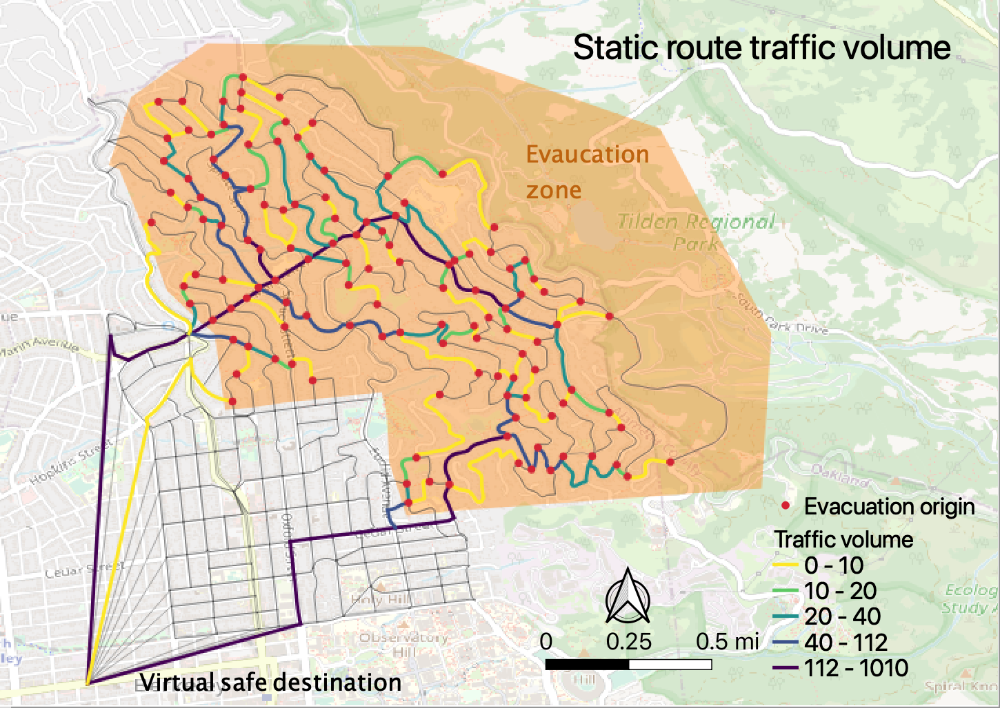

# Quiz 3

In this quiz, you will be asked to write a simple python program that implements all-or-nothing traffic assignment. You will be provided with:
* network inputs file: [berkeley_edges.csv](https://raw.githubusercontent.com/UCB-CE170a/Fall2020/master/traffic_data/berkeley_edges.csv) and [berkeley_nodes.csv](https://raw.githubusercontent.com/UCB-CE170a/Fall2020/master/traffic_data/berkeley_nodes.csv)
* od inputs file: [od_10pn.csv](https://raw.githubusercontent.com/UCB-CE170a/Fall2020/master/traffic_data/od_10pn.csv)

Below is a visualization of the input files and output files. As you can see, our study area covers most of north Berkeley. The orange area is a hypothesized zone that needs to be evacuated. It is assumed that there are 10 trips starting from each road network node in the evacuation zone. The node titled "virtual safe destination" at the bottom left is a virtual supernode set as the destination of all evacuees.

The outcome you will need to obtain is:
* number of vehicles using each road link

Save the output to a csv file titled `quiz3_yourname.csv` and submit it. The first few lines of your submission may look like the table below. However, it is possible that your first few rows are corresponding to different road links.

| link_id | volume |
|---------|--------|
|747      |20      |
|266      |30      |
|198      |510     |
|39       |650     |
|41       |870     |

A visualization of the output traffic volume from the all-or-nothing assignment looks like below.

Click the icon below to start:

