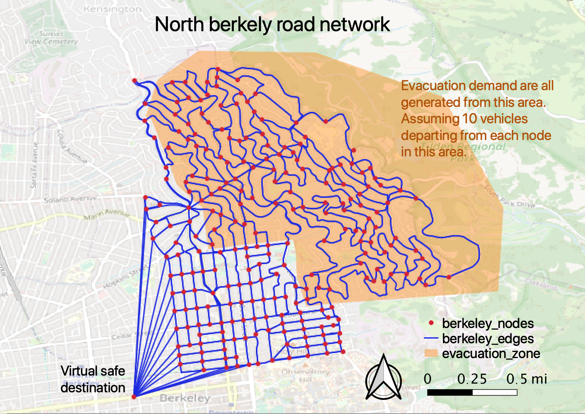

# Quiz 3

In this quiz, you will complete and run a simple python program that implements all-or-nothing traffic assignment. You will be provided with:
* road network input files: [berkeley_edges.csv](https://raw.githubusercontent.com/UCB-CE170a/Fall2020/master/traffic_data/berkeley_edges.csv) and [berkeley_nodes.csv](https://raw.githubusercontent.com/UCB-CE170a/Fall2020/master/traffic_data/berkeley_nodes.csv)
* origin-destination (OD) input file: [od_10pn.csv](https://raw.githubusercontent.com/UCB-CE170a/Fall2020/master/traffic_data/od_10pn.csv), where the trip origins and destinations are all nodes in the road network.

Below is a visualization of the input files and output files. As you can see, our study area covers mostly the north Berkeley. The orange area is a hypothesized evacuation zone. It is assumed that in our simulated scenario, there are 10 trips starting from each road network node inside the evacuation zone. The node titled "virtual safe destination" at the bottom left is a virtual supernode where all trips end.

The outcome you will need to obtain is:
* number of vehicles using each road link (traffic volume)

Save the output to a csv file titled `quiz3_yourname.csv` and submit it. The first few lines of your submission may look like the table below. However, it is possible that your first few rows show different road links.

| link_id | volume |
|---------|--------|
|747      |20      |
|266      |30      |
|198      |510     |
|39       |650     |
|41       |870     |

### submission
Submit `quiz3_yourname.csv` to bCourse by Sep 24, 2020 at 11:59p.

Click the icon below to start:

