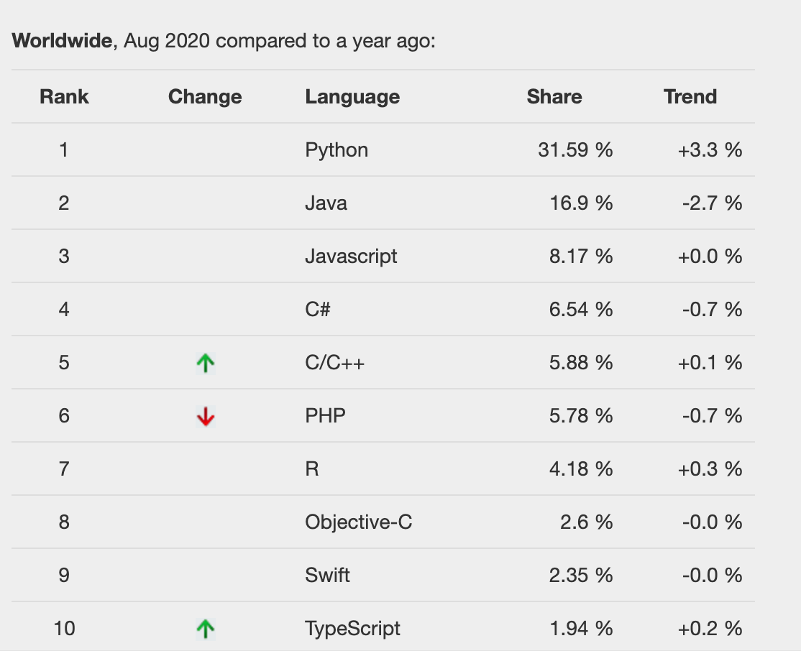
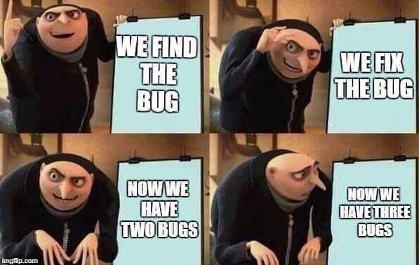

# Python Exercise Day 0

## Objectives
* Fundamentals of programming 
* Introduce python
* Introduce github/colab
* Tips & Resources

## Programming 
**So, what is Programming?**
> Programming is a way to "instruct the computer to perform various task"

To let people do stuff, you talk/yell to them. To let computers do tasks, you program/bug on them. 

**Ok... Why should I bother about coding?**

* **Efficiency.** Let the computer do repetitive tasks so you can have extra time doing more meaningful things, such as watching cats on Youtube. 
* **Self-sufficient.** Don't pay extra money on commercial softwares! With coding skills, you can program by yourself (less likely) or use open source programs. (Yeah!!)
* **Sharpening your mind & be responsible.** Computer does whatever you told them. If your program does not run, it is always your problem. Think clear, write clean and blame no one. 
* **You have to do it.**  As a student, it is part of your grade. When you start working, it is part of your salary. 

## Python 
Python is extremely popular: 

So what is python?
> Python is an interpreted, object-oriented, high-level programming language with dynamic semantics. 

Above is the definition of python from the [official python website](https://www.python.org/doc/essays/blurb/). If you don't understand it, I will explain it. 

* **Interpreted**: Unlike many programming languages such as C++, python does not need to be compiled before execution. You can understand compilation as a translation process that translate the language you understand (programming language) to language your computer understand (machine language). Python has its own embedded interpretor so as long as your syntax (grammar) is right, it will be automatically complied (interpreted) and ready to be run. 
* **Object-oriented**: You can group similar things (name, age, id)together to form a object (person). A very powerful technique. Read more on [Wikipedia](https://en.wikipedia.org/wiki/Object-oriented_programming). 
* **High-level**: It uses natural language elements so the developed program is simpler and more understandable than using a low-level language. In other words, you write less but achieve more. 
* **Dynamic semantics**: you can assign to one object multiple values, as it will update itself during runtime. 

In summary, python is very popular and easy to write. Being popular means there are lots of open-source codes to borrow (import) and being simple is always a good thing. 

## Github
To make a long story short, Github is a website that host open source codes. You use Google/one drive to host your files, and Github to host your codes. It also ties with "git", a version control program that preserves your codes histories.
[Click here for more details](https://www.howtogeek.com/180167/htg-explains-what-is-github-and-what-do-geeks-use-it-for/)

## Colab 
Using Google Doc, you can write and share your documents in your browser. Using Google Colab, you write/execute and share Python codes in your browser. As there is no need to install Microsoft Office on your computer to use Google Doc, you don't need to configure programming environment to run Colab. Python tutorials and homeworks will be presented in Colab for this class. 

Click the icon below to start the official Google Colab tutorial:

## Tips
* [Google](https://www.google.com/) is your best friend. If you are confused, ask Google. 
* [Stack Overflow](https://stackoverflow.com/) is your second best friend. If you see strange error messages popping up from your program, search on there. 
* Be patient. Rome is not built in a day. 
* Do python exercises in this repository and watch my videos. 
* Taking serious computer science classes. Considering taking [UCB CS61A](https://cs61a.org/) for general programming, [UCB CS61B](https://inst.eecs.berkeley.edu/~cs61b/sp20/) for data structure, [UCB CS61C](https://cs61c.org/su20/) for computer architecture. 

